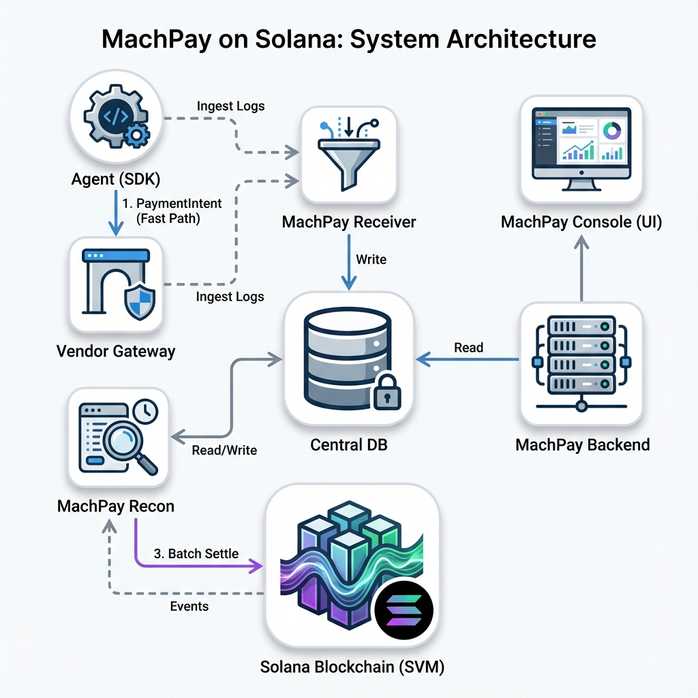

# MachPay High-Level Design (HLD)

## 1. System Overview
MachPay is a high-throughput micropayments protocol for AI Agents. It decouples the "Fast Path" (off-chain signature exchange) from the "Slow Path" (on-chain settlement).

The architecture is composed of the following key services:

## 2. Components

### 2.1. Agent SDK (`machpay-sdk`)
**Role**: Client Library
**Functionality**:
- Manages Agent Identity (Keys).
- Discovers Vendors via `ServiceRegistry`.
- Signs `PaymentIntent` (Ed25519).
- Handles `402 Payment Required` challenges seamlessly.
- **Telemetry**: Pushes transaction logs to `machpay-receiver` for visibility.

### 2.2. MachPay Gateway (`machpay-gateway`)
**Role**: Vendor Proxy
**Functionality**:
- Reverse proxy sitting in front of Vendor LLMs/APIs.
- Intercepts requests & blocks unpaid ones (x402).
- Verifies `PaymentIntent` signatures using local/cached state.
- **Telemetry**: Pushes successful intent logs to `machpay-receiver`.

### 2.3. MachPay Receiver (`machpay-receiver`)
**Role**: High-Throughput Ingress
**Functionality**:
- **Write-Heavy Service**: Optimized for ingestion.
- Exposes gRPC/HTTP endpoints for SDKs and Gateways.
- Aggregates heavily:
    - `PaymentIntents` (from Gateways).
    - Client Logs (from Agents).
- Buffers and writes to the Central Database (SQL/Timescale).

### 2.4. MachPay Backend (`machpay-backend`)
**Role**: Management API
**Functionality**:
- **Read-Heavy Service**: Powers the Dashboard.
- Exposes APIs for:
    - Analytics (Volume, Latency).
    - User Profiles.
    - API Key Management.
- Reads primarily from the DB populated by Receiver/Recon.

### 2.5. MachPay Recon (`machpay-recon`)
**Role**: Settlement & Security Worker
**Functionality**:
- **Async Processing**:
    - Scans DB for "Pending" Intents.
    - Aggregates Intents into Batches (Merkle Roots).
    - **Submits Batches** to `MachPay` Program on-chain.
- **Fraud Detection**:
    - Detects Equivocation (Double Signing).
    - Generates Fraud Proofs.
- **Blockchain Sync**:
    - Listens for `BondDeposited`, `BatchSettled` events.
    - Updates local DB state.

### 2.6. Solana Programs (Anchor)
- **GlobalBond**: PDA holding locks/stakes.
- **MachPay**: Verifies batches & signatures.
- **ServiceRegistry**: Marketplace directory (PDA).

## 3. Data Flow

### Fast Path (Payment)
1.  Agent sends HTTP Request -> Gateway.
2.  Gateway responds `402` + Challenge.
3.  Agent signs Intent -> Gateway.
4.  Gateway verifies -> Serves Request.
5.  Gateway asynchronously pushes Intent -> **Receiver** -> DB.

### Slow Path (Settlement)
1.  **Recon** wakes up (Cron/Event).
2.  Recon fetches un-settled Intents from DB.
3.  Recon checks for Fraud (Double Spending).
4.  Recon creates Batch -> Submits to **MachPay Program**.
5.  Blockchain Finalizes -> Emits Event.
6.  Recon sees Event -> Marks Intents as "Settled" in DB.
