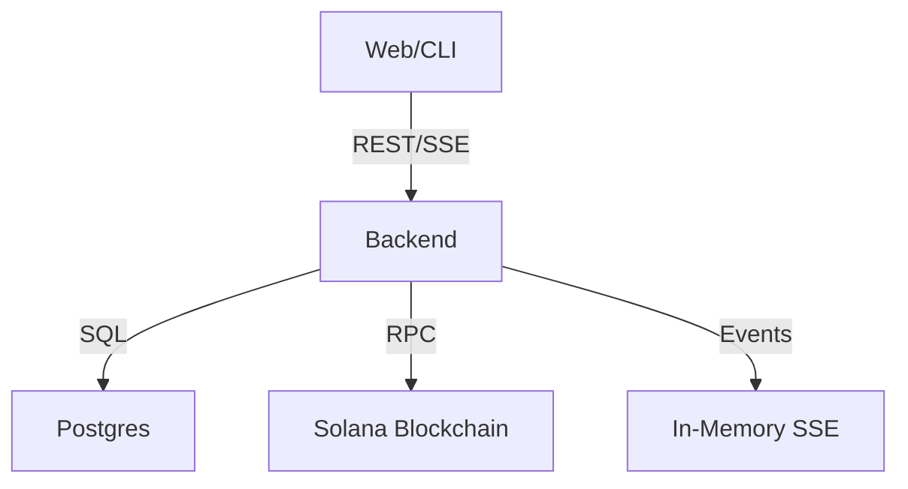

# Low-Level Design: MachPay Backend (`machpay-backend`)

## 1. Introduction
The `machpay-backend` is the core management API and Orchestrator. It serves as:
1.  **User Portal**: Manages Identities (SIWS) and Profiles.
2.  **Custodial Agent Host**: hosts "Managed Agents" (Server-Side Wallets).
3.  **Ledger**: Maintains an internal high-speed SQL ledger for off-chain transactions.
4.  **Orchestrator**: Handles contract indexing and settlement.

## 2. Architecture

### 2.1. Tech Stack
-   **Language**: Go (Current Codebase).
-   **Framework**: Hertz (High-perf HTTP).
-   **Database**: PostgreSQL (Users, Agents, Ledger, Invoices).
-   **Real-Time**: In-Memory Broker (SSE). *Plan*: Migration to Redis PubSub for scaling.

### 2.2. Data Flow


## 3. Core Modules & API Flows

### 3.1. User Authentication (SIWS)
Matches `auth_handler.go`. Implements strict challenge-response.

1.  **Challenge**:
    -   `POST /auth/challenge` `{ address: "DstG..." }`
    -   **Response**: `{ nonce: "...", expiresAt: 123 }`
    -   *Logic*: Creates ephemeral nonce, stores in Redis/DB with TTL.

2.  **Login (Wallet)**:
    -   `POST /auth/login/wallet` `{ address, signature }`
    -   **Verify**: Ed25519 Verify(Nonce, Sig, Pubkey).
    -   **Success**: Issues JWT (Claims: `userID`, `role`).

3.  **Google OAuth (Hybrid)**:
    -   `POST /auth/login/google` (ID Token exchange).

4.  **Email OTP (Passwordless)**:
    -   `POST /auth/email/send-otp` `{ email }` -> Sends 6-digit code.
    -   `POST /auth/email/verify-otp` `{ email, code }` -> Returns `{ token, user }`.
    -   *Security*: Rate limited (5/hr), max 3 attempts.

### 3.2. Agent Management (Unified Flow)
A cli-driven workflow that redirects to UI for onboarding.

1.  **Initialization (CLI)**:
    -   Developer runs `machpay agent init`.
    -   CLI checks for local Keypair.
    -   If new, generates `secret_key.json`.
    -   *Logic*: CLI checks if this Key is linked. If not, prompts for Link.

2.  **Linking & Onboarding**:
    -   Developer runs `machpay agent link`.
    -   CLI generates **Pairing Code** and a URL: `https://console.machpay.xyz/link?code=XYZ`.
    -   **User Action**:
        -   Opens URL -> Authenticates (SIWS/Google).
        -   **Creates Profile**: If new, prompts to create "Agent Profile" & Deposit Funds.
        -   **Approves**: Connects local Key to Cloud Profile.
    -   *Result*: CLI confirms `Linked to Agent: <Name>`.

3.  **Runtime**:
    -   SDK requests sign with local Key.
    -   Gateway validates Key + checks Cloud Balance.

4.  **Monitoring**:
    -   User views Logs/Metrics on Console.
    -   SDK CLI: `machpay agent balance` (Read-only from Backend).

### 3.3. Vendor Management (Unified Flow)
Similar CLI-first approach for Vendors.

1.  **Initialization (Server)**:
    -   Vendor installs Gateway: `curl | sh`.
    -   Runs `machpay-gateway init` -> Generates local Identity.

2.  **Linking & Onboarding**:
    -   Vendor runs `machpay-gateway link`.
    -   CLI shows URL: `https://console.machpay.xyz/link?code=XYZ`.
    -   **User Action**:
        -   Opens URL -> Authenticates.
        -   **Creates Profile**: Sets Service Type, Price, and **Withdrawal Address**.
        -   **Approves**: Connects Gateway to Cloud Profile.

3.  **Earnings & Withdrawal**:
    -   **Earn**: Gateway processes requests -> Backend credits `UnsettledBalance` in SQL Ledger.
    -   **Withdraw**: User clicks "Withdraw" on Console -> Backend triggers `SettlementWorker`.

### 3.4. Internal Ledger (SQL)
Matches `models/sql/transaction.go`.
Used for high-speed interactions between Managed Agents and Vendors.

**Schema**:
```sql
CREATE TABLE transaction (
    id VARCHAR(64) PRIMARY KEY,
    hash VARCHAR(64) UNIQUE, -- Internal Hash
    from_agent_id VARCHAR(64) REFERENCES users(id),
    to_vendor_id VARCHAR(64),
    amount NUMERIC(20, 9),
    status VARCHAR(20) DEFAULT 'confirmed',
    latency INT,
    created_at TIMESTAMP
);
```

### 3.5. Streaming (SSE)
matches `stream_handler.go`.
-   **Endpoint**: `GET /events`
-   **Mechanism**: **In-Memory Broker** (`realtime.Broker`).
-   **Topics**:
    -   `ticker`: Global transaction feed (Anonymized).
    -   `stats`: Aggregate Platform stats.
    -   `user:{id}`: Private alerts (Deposit success, Low balance, **Settlement Update**).

### 3.6. Service Discovery (MCP Marketplace)
The Backend acts as the **Semantic Registry** for all active Agents and Vendors.

1.  **Registry (Indexing Flow)**:
    -   **Trigger**: Vendor registers via `POST /vendor/endpoints`.
    -   **Input**: `Description` + `MCP Tool Definitions`.
    -   **Process**:
        1.  Concatenate: `Name + Description + ToolNames`.
        2.  **Embed**: Call OpenAI (`text-embedding-ada-002`) -> `[]float32`.
        3.  **Store**: `INSERT INTO service_embeddings (vendor_id, embedding) VALUES ($1, $2)`.
    -   *Optimization*: Backend indexes this metadata into **pgvector**.

2.  **Resolution** (`GET /v1/services/{id}`):
    -   Agents resolve a Service ID (e.g., `openai-gpt4`) to a **Gateway URL**.
    -   Returns: `Gateway PubKey`, `Price`, and `Token Mint`.

3.  **Semantic Search** (`GET /v1/services/search?q=...`):
    -   Agents submit natural language ("Find me a cheap LLM").
    -   Backend returns ranked list of valid Vendors.

## 4. Reconciliation Integration (`machpay-recon`)
The Backend relies on the separate `machpay-recon` service for all blockchain writing and indexing.

### 4.1. Deposits (Inbound)
-   **Responsibility**: `machpay-recon` listens to Solana.
-   **Logic**:
    1.  User sends Funds to Vault -> On-Chain Event.
    2.  `machpay-recon` indexes event -> Updates `users.balance` in DB.
    3.  **Backend Role**: Read-Only. APIs like `GET /agent/balance` simply query the DB.

### 4.2. Settlement & Payouts (Outbound)
-   **Responsibility**: `machpay-recon` executes batch settlements.
-   **Vendor Withdrawal Flow**:
    1.  **Backend**: `POST /vendor/withdraw` creates a `PayoutIntent` record in DB (`status='PENDING'`).
    2.  **Recon**: Picks up pending intents.
    3.  **Recon**: Packs instructions -> Submits Solana Transaction.
    4.  **Recon**: Updates DB to `status='CONFIRMED'`.
    5.  **Backend**: APIs reflect the new "Settled" status to the user.

### 4.3. Visibility
The Backend aggregates data written by Recon:
-   **Unsettled**: Liability tracked in internal SQL Ledger.
-   **Settled**: Confirmed on-chain balance (indexed by Recon).

### 4.4. Settlement Failures (Optimistic Reversal)
Gateways accept payments optimistically. If `machpay-recon` fails to settle (e.g., Agent rugs/insolvency 0x102), the Backend must **Reverse the Credit**.

**Event Consumer (`settlement.failed`)**:
1.  **Debit Vendor**: `UPDATE profiles SET unsettled_balance = unsettled_balance - Amount WHERE user_id = VendorID`.
2.  **Suspend Agent**: `UPDATE users SET status = 'SUSPENDED' WHERE id = AgentID`.
3.  **Notify Vendor**: Send Email/Webhook: *"Settlement Failed for Agent X. Your pending balance has been adjusted."*

## 5. Database Schema (PostgreSQL)

### 5.1. Identity & Access
Matches `models/sql/user.go` and `api_key.go`.

```sql
CREATE TABLE users (
    id BIGSERIAL PRIMARY KEY,
    email VARCHAR(255) UNIQUE,
    wallet_address VARCHAR(44) UNIQUE, -- Solana Pubkey
    role VARCHAR(20) NOT NULL, -- 'architect' | 'operator' | 'observer'
    created_at TIMESTAMPTZ DEFAULT NOW()
);

CREATE TABLE api_keys (
    id BIGSERIAL PRIMARY KEY,
    user_id BIGINT REFERENCES users(id),
    name VARCHAR(50),
    prefix VARCHAR(20),     -- "mp_sk_live_..."
    hash VARCHAR(64),       -- Scrypt/Argon2
    permissions TEXT,       -- "read,write"
    last_used_at TIMESTAMPTZ
);
```

### 5.2. Profiles (Unified)
Matches `models/sql/profile.go`. Stores metadata for Agents and Vendors.

```sql
CREATE TABLE profiles (
    user_id BIGINT PRIMARY KEY REFERENCES users(id),
    type VARCHAR(20), -- 'agent' | 'vendor'
    name VARCHAR(100),
    description TEXT,
    -- Vendor Specific
    service_type VARCHAR(50),
    withdrawal_address VARCHAR(44),
    base_price_atomic NUMERIC(20,0),
    -- Agent Specific
    risk_score INT DEFAULT 0
);

CREATE TABLE service_embeddings (
    vendor_id BIGINT REFERENCES users(id),
    embedding vector(1536), -- OpenAI ada-002 dimension
    content_hash VARCHAR(64), -- To skip re-embedding if unchanged
    updated_at TIMESTAMPTZ DEFAULT NOW(),
    PRIMARY KEY (vendor_id)
);
```

### 5.3. Financial Ledger (High-Speed)
Matches `models/sql/transaction.go`. Allows sub-100ms off-chain payments.

```sql
CREATE TABLE transactions (
    id VARCHAR(64) PRIMARY KEY,
    hash VARCHAR(64) UNIQUE,
    from_agent_id BIGINT REFERENCES users(id),
    to_vendor_id BIGINT REFERENCES users(id),
    amount NUMERIC(20, 9),
    status VARCHAR(20),   -- 'confirmed', 'failed'
    settled_at TIMESTAMPTZ, -- NULL = Unsettled (Pending Payout)
    created_at TIMESTAMPTZ DEFAULT NOW()
);
```

### 5.4. Settlement Bridge (Recon)
Matches `lld-receiver.md` schema to ensure compliance.

```sql
CREATE TABLE payment_intents (
    id UUID PRIMARY KEY,
    agent_pubkey VARCHAR(44),
    gateway_pubkey VARCHAR(44),
    amount_atomic NUMERIC(20,0),
    signature TEXT,
    status VARCHAR(20) -- 'PENDING' -> 'SETTLED'
);

CREATE TABLE payouts (
    id VARCHAR(64) PRIMARY KEY,
    vendor_id BIGINT REFERENCES users(id),
    amount NUMERIC(20, 9),
    tx_hash VARCHAR(88), -- Solana Tx Signature
    status VARCHAR(20) -- 'PENDING' -> 'CONFIRMED'
);
```

### 5.5. Telemetry (Read-Only)
Managed by `machpay-receiver`, read by Backend for Dashboard.
-   `metrics` (Hypertable: time, entity_id, value).
-   `logs` (Partitioned: time, level, msg).

## 6. Traffic Simulation
The backend includes a built-in "Real World" simulator to generate realistic traffic for the Dashboard and Ticker. Controlled by `ENABLE_SIMULATION=true`.

### 6.1. Behavior
The `SQLSimulator` runs three concurrent loops:
1.  **Ticker Feed (500ms)**: ephemeral mock transactions.
2.  **Real Transactions (5s)**: persistent DB records.
3.  **User Balances (2s)**: simulated spend/earn.

### 6.2. Geo-Distribution
Traffic is stamped with random "Data Centers" for Globe viz (Virginia, Tokyo, etc.).

## 7. API Reference & Schemas

## 7. API Reference & Schemas
**Base URL**: `/v1`

### 7.1. Public APIs
| Method | Endpoint | Response |
| :--- | :--- | :--- |
| `GET` | `/v1/public/dashboard` | `DashboardResponse` |
| `GET` | `/v1/ticker` | `[TransactionDTO]` |
| `GET` | `/v1/network/stats` | `NetworkStatsDTO` |
| `GET` | `/v1/network/vectors` | `[GlobeVectorDTO]` |
| `GET` | `/v1/services` | `[ServiceDTO]` |
| `GET` | `/v1/services/search?q=...` | `[ServiceDTO]` |
| `GET` | `/v1/services/{id}` | `ServiceDTO` |
| `GET` | `/v1/agents/leaderboard` | `[LeaderboardItem]` |

#### B. API Schemas
**Common Types**:
-   `SolanaAddress`: Base58 string (e.g., `DstG...`)
-   `Signature`: Base58 string (64 bytes)
-   `Lamports`: uint64

**ServiceDTO**:
```json
{
  "id": "openai-gpt4",
  "name": "GPT-4 Turbo",
  "description": "High intelligence model...",
  "gateway_url": "https://gateway.openai.com",
  "price_atomic": 5000,
  "token_mint": "EPjFW...USDC...",
  "mcp_tool_def": { ... } // MCP Protocol Schema
}
```

### 7.2. Auth
| Method | Endpoint | Request Body |
| :--- | :--- | :--- |
| `POST` | `/v1/auth/challenge` | `{ "address": "DstG..." }` |
| `POST` | `/v1/auth/login/wallet` | `{ "address": "...", "signature": "...", "message": "..." }` |
| `POST` | `/v1/auth/email/send-otp` | `{ "email": "..." }` |
| `POST` | `/v1/auth/email/verify-otp` | `{ "email": "...", "code": "..." }` |

**Schemas**:
```json
// LoginRequest
{
  "address": "DstG...pubkey...",
  "signature": "5X...signature...",
  "message": "machpay.xyz wants you to sign in..." // The full SIWS message
}
```

### 7.3. Agent APIs
**Headers**: `Authorization: Bearer <JWT>`

| Group | Method | Endpoint | Description |
| :--- | :--- | :--- | :--- |
| **Core** | `GET` | `/v1/agent/balance` | Get Wallet Balance. |
| | `GET` | `/v1/agent/transactions` | History. |
| | `POST` | `/v1/agent/pay` | Execute Payment. |
| | `POST` | `/v1/agent/deposit` | Credit funds. |
| **Bond** | `POST` | `/v1/agent/bond/deposit` | Stake funds. |
| | `POST` | `/v1/agent/bond/withdraw` | Unstake funds. |
| **Limits** | `GET` | `/v1/agent/limits` | Get spending limits. |
| | `PUT` | `/v1/agent/limits` | Update limits. |
| **Keys** | `GET` | `/v1/agent/keys` | List API Keys. |
| | `POST` | `/v1/agent/keys` | Create API Key. |

```json
// DepositRequest
{
  "txHash": "5K...solana...signature" // Proof of transfer on-chain
}
```

### 7.4. Vendor APIs
**Headers**: `Authorization: Bearer <JWT>` (Operator)

| Group | Method | Endpoint | Description |
| :--- | :--- | :--- | :--- |
| **Stats** | `GET` | `/v1/vendor/stats` | Revenue, Latency. |
| **Keys** | `GET` | `/v1/vendor/keys` | List Gateway Keys. |
| | `POST` | `/v1/vendor/keys` | Create Gateway Key. |
| **Payouts** | `POST` | `/v1/vendor/payout` | Withdraw Earnings. |
| | `GET` | `/v1/vendor/payouts` | Payout history. |
| **Endpoints** | `GET` | `/v1/vendor/endpoints` | List registered endpoints. |
| | `POST` | `/v1/vendor/endpoints` | Register new endpoint. |

```json
// PayoutRequest
{
  "amount": 500.00,
  "destinationWallet": "DstG...pubkey", // Solana Wallet
  "reference": "payout_001"
}

// EndpointRegistrationRequest (Dual-Write from Gateway)
{
  "tx_signature": "5K...solana...signature", // Proof of on-chain PDA creation
  "pda_address": "VendorPDA_Pubkey",
  "min_price": 5000,
  "service_type": "inference-llama3"
}
```

## 8. Deployment
-   **Dockerfile**: Multi-stage build (Go 1.21).
-   **Env**: `ENABLE_SIMULATION` (Traffic Gen), `DATABASE_URL`, `SOLANA_RPC`.
