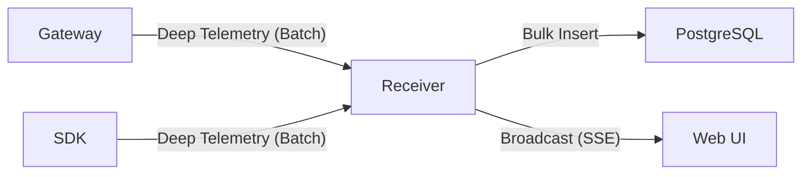

# Low-Level Design: MachPay Receiver (`machpay-receiver`)

## 1. Introduction
The `machpay-receiver` is the high-write-throughput **Ingestion Service**. It acts as the central funnel for all system data: finalized `PaymentIntents` from Gateways and telemetry logs from Agents/SDKs. It buffers writes to the database and streams real-time updates to the Console.

## 2. Architecture

### 2.1. Tech Stack
-   **Language**: **Go** (Golang).
-   **Framework**: **Fiber** (v2).
-   **Database**: **PostgreSQL 16+** (Partitioned Tables for Logs/Metrics).
-   **Transport**: HTTP/2 (Ingest) & SSE (Real-time).

### 2.2. Data Flow


### 2.3. Core Components

#### A. Ingestion API (`POST /v1/ingest`)
... (Same logic)

#### B. Persistence Worker (Batcher)
#### B. Persistence Worker (Batcher)
-   **Role**: Accumulates events in an **In-Memory Slice** (No DB IO per request).
-   **Trigger**: Flushes to DB ONLY when:
    -   `Time > 1s` (Latency limit) OR
    -   `Count > 1000` (Batch size limit).
-   **Action**: Uses `pgx.CopyFrom` to bulk insert the entire slice in **one transaction**.

#### C. Batch Processors (Background)
Since we are using Standard PostgreSQL, we need explicit workers to manage data lifecycle and derived stats:

1.  **Rollup Worker** (Hourly):
    -   **Task**: Aggregates `raw_metrics` (14 days) into `hourly_stats` (1 year).
    -   **Action**: Executes `REFRESH MATERIALIZED VIEW CONCURRENTLY` or `INSERT INTO stats_1h SELECT ...`.
    -   **Why**: Dashboard queries heavily rely on pre-computed aggregates for speed.

2.  **Partition Manager** (Daily):
    -   **Task**: Creates new partitions for upcoming days; Detaches/Drops old partitions based on Retention Policy.
    -   **Tool**: `pg_partman` or custom Go worker.

#### D. Metadata Upserter (Config Sync)
-   **Trigger**: When `GatewayTelemetry` contains a `config` block.
-   **Action**: Updates `vendor_profiles` table in Postgres.
-   **SQL**: `UPDATE profiles SET base_price_atomic = $1, withdrawal_address = $2 WHERE user_id = (SELECT id FROM users WHERE wallet_address = $3)`.

## 3. Event Schemas (Exhaustive)

### 3.1. Gateway Deep Telemetry
Sent every 60s. Captures Infrastructure + Business Logic.

```json
{
  "source": "gateway",
  "gateway_id": "Base58_Pubkey",
  "period_start": 1700000000,
  "period_end": 1700000060,
  "config": {
    "accepted_mint": "EPjFW...USDC...",
    "price_per_unit": 5000,
    "version": "v1.2"
  },
  "system": {
    "cpu_usage_percent": 12.5,
    "ram_usage_mb": 256,
    "goroutines": 450,
    "gc_pause_ns": 15000,
    "uptime_seconds": 86400
  },
  "network": {
    "bytes_in": 1048576,
    "bytes_out": 524288,
    "active_connections": 120
  },
  "business": {
    "total_revenue": 50000,
    "routes": {
      "/chat": { "200": 500, "402": 100, "500": 2, "latency_p99": 150 },
      "/image": { "200": 50, "402": 10, "500": 0, "latency_p99": 500 }
    },
    "solvency_rejects": 15,
    "replay_attacks_blocked": 5,
    "signature_failures": 2
  }
}
```

### 3.2. SDK Deep Telemetry
Sent every 60s. Captures Client-side performance and spending.

```json
{
  "source": "sdk",
  "agent_id": "Base58_Pubkey",
  "period_start": 1700000000,
  "period_end": 1700000060,
  "wallet": {
    "sol_balance_lamports": 50000000,
    "usdc_balance_atomic": 2000000,
    "low_balance_warnings": 0
  },
  "interactions": {
    "Vendor_A": {
      "attempts": 100,
      "success": 98,
      "payment_latency_p99": 200,
      "vendor_latency_p99": 500,
      "errors": { "timeout": 1, "402_loop_failed": 1 },
      "spend_atomic": 50000
    }
  }
}
```

### 3.3. Payment Intent (Settlement)
Sent by Gateways upon successful proxying.

```sql
CREATE TABLE payment_intents (
    id UUID PRIMARY KEY DEFAULT gen_random_uuid(),
    gateway_id CHAR(44) NOT NULL,
    agent_id CHAR(44) NOT NULL,
    nonce NUMERIC(20,0) NOT NULL,
    amount NUMERIC(20,0) NOT NULL,
    token CHAR(44) NOT NULL,
    signature TEXT NOT NULL,
    status VARCHAR(20) DEFAULT 'PENDING',
    created_at TIMESTAMPTZ DEFAULT NOW()
);
```

## 4. Database Schema (TimescaleDB)

### 4.1. Metrics Hypertable
Optimized for time-series queries (Graphs).

```sql
CREATE TABLE metrics (
    time TIMESTAMPTZ NOT NULL,
    entity_id CHAR(44) NOT NULL, -- Agent or Gateway ID
    metric_name TEXT NOT NULL,
    value DOUBLE PRECISION NOT NULL,
    labels JSONB
);

-- Convert to Hypertable or Standard Partition
CREATE TABLE metrics (
    time TIMESTAMPTZ NOT NULL,
    entity_id CHAR(44) NOT NULL,
    metric_name TEXT NOT NULL,
    value DOUBLE PRECISION NOT NULL,
    labels JSONB
) PARTITION BY RANGE (time);

-- Create partitions automatically (e.g., pg_partman)
-- 7-day retention for raw metrics, then rolled up.
```

## 5. Data Retention Policy
To manage storage growth ("capture as much metrics as possible"), we use **Table Partitioning**.

| Data Type | Retention | Strategy |
| :--- | :--- | :--- |
| **Raw Metrics** | 14 Days | Partition by Day. Drop old partitions. |
| **Aggregates (1h)** | 1 Year | Computed via Materialized Views. |
| **Payment Intents** | 5 Years | Partition by Month. Move to Cold Storage (S3/Glacier) after 1 year. |
| **Debug Logs** | 3 Days | Partition by Hour. Aggressive cleanup. |

## 6. Scalability & Failure Modes
-   **Database Down**: Receiver buffers in-memory (up to N items) then drops packets (Metrics are lossy-tolerant).
-   **Backpressure**: Return `429 Too Many Requests` if internal channels are full.
-   **Scaling**: Stateless API. Run multiple replicas behind Nginx/ALB. Postgres handles the write volume via Copy Protocol.
