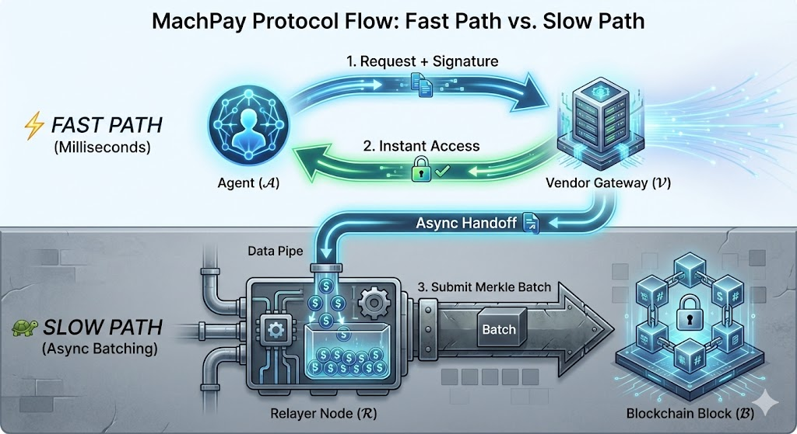
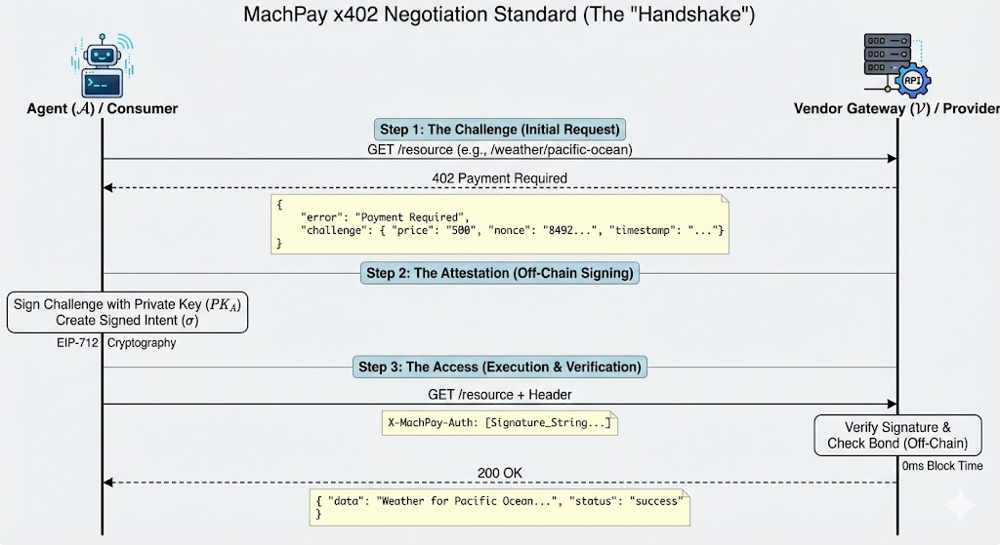
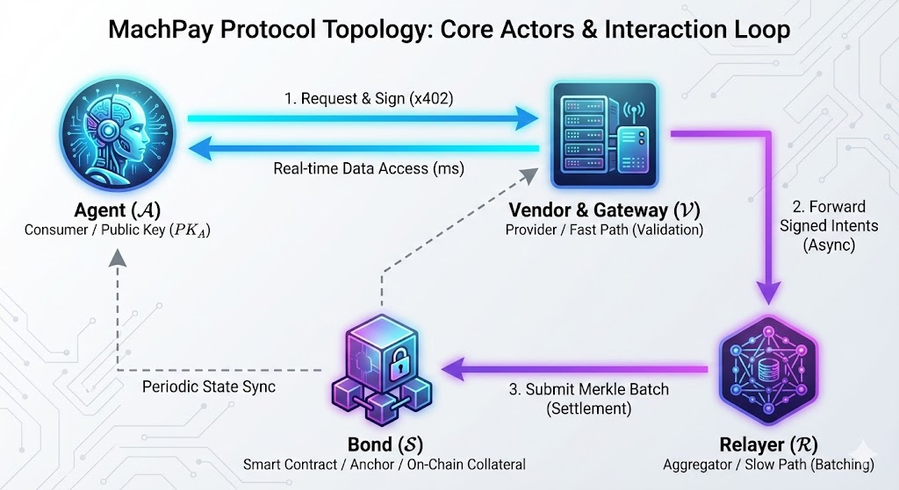
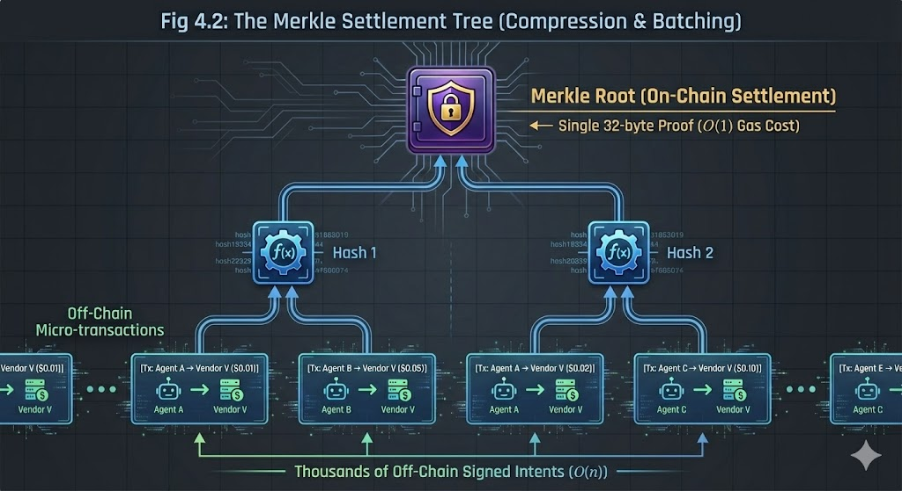
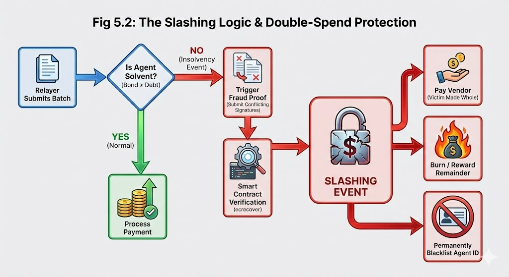
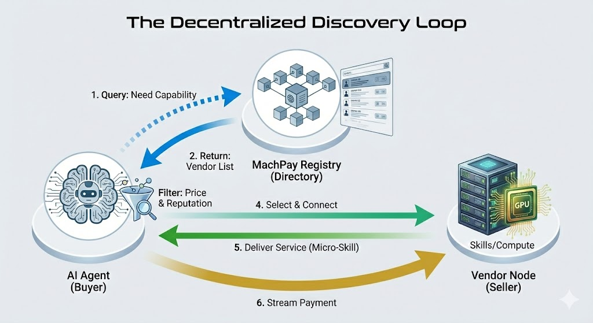
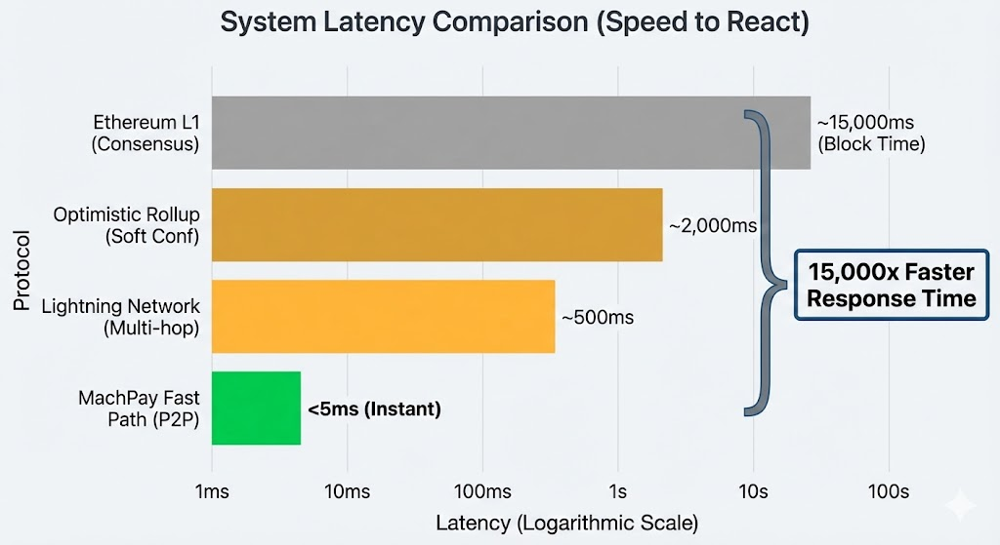
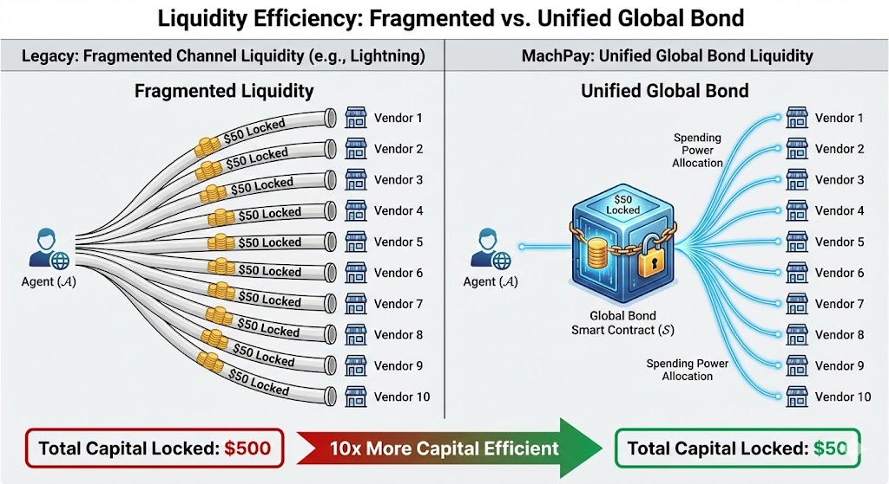
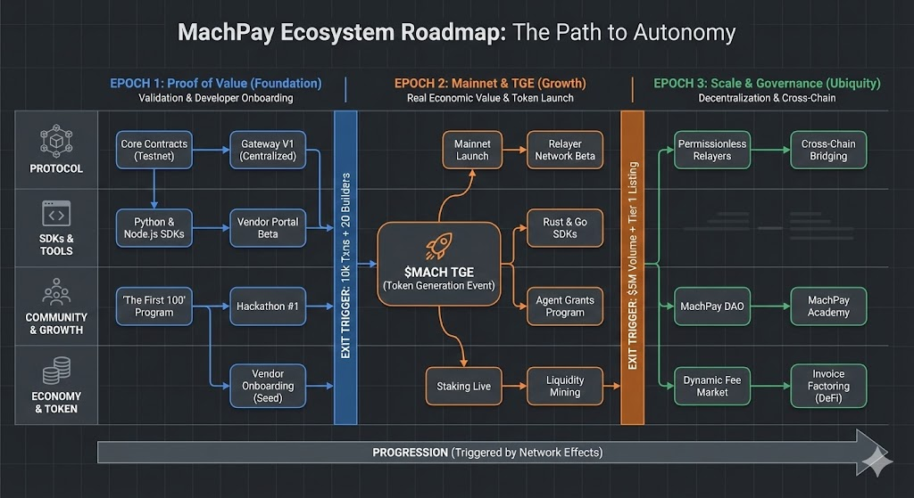

# MachPay: A Trustless Economic Protocol for the Autonomous Agent Era

**[Abhishek Tomar](https://www.linkedin.com/in/abhishek-tomar-150623b/)** *[machpay.xyz](https://machpay.xyz)*

**Whitepaper v1.1**

---

## Abstract

The emergence of Autonomous Artificial Intelligence (Agentic AI) signals a fundamental shift in global economic activity, transitioning from human-mediated commerce to Machine-to-Machine (M2M) value transfer. However, the existing financial infrastructure operates on a "Human-in-the-Loop" paradigm—reliant on legal identity (KYC), manual authorization, and high-friction settlement layers—which renders it incompatible with the latency and granularity requirements of autonomous software.

This paper proposes **MachPay**, a decentralized, state-channel-inspired payment protocol designed to solve the *Machine Economic Trilemma*: the inability to simultaneously achieve (1) Sub-Second Latency, (2) Micro-Transaction Viability, and (3) Trustless Finality. By introducing a novel **Optimistic Delivery** mechanism secured by **Proof-of-Solvency** bonds, MachPay decouples the application layer from the settlement layer. We demonstrate that this architecture reduces transaction overhead by orders of magnitude (O(n) $\rightarrow$ O(1)), enabling a new class of high-frequency, algorithmic economic flows that were previously theoretically impossible.

---

## 1. Introduction: The Rise of the Machine Economy

We are witnessing a fundamental shift in who—or what—drives the global economy. For centuries, commerce was human-to-human. The internet era moved this to human-to-machine (e-commerce). Now, we are entering the **Agentic Era**, where software programs are becoming the primary economic actors.

To a junior engineer, an "AI Agent" might look like a chatbot. But economically, it is a **specialized digital worker**. Unlike a passive script, an autonomous agent perceives its environment, makes independent decisions, and executes complex goals without human hand-holding.

**Imagine the following scenarios:**
* **A Supply Chain Agent** detects a storm in the Pacific and instantly buys hyper-local weather data ($0.005) to reroute a shipment.
* **A Research Agent** needs to read a single paywalled academic paper ($0.50) to answer a user's query.
* **A Trading Agent** rents 500ms of specialized GPU compute ($0.02) to run a single inference model.

Crucially, the traditional "SaaS Subscription" model fails here. An autonomous agent cannot manage 500 unique logins and $20/month subscriptions just to access a single data point from each provider. The friction of "Sign Up" is as fatal to an automated workflow as the friction of payment. These agents need to make thousands of **micro-decisions** and **micro-payments** per day, hopping between vendors instantly.

However, they currently cannot do this because the financial rails of the internet were built for humans, not machines.

### 1.1 The Infrastructure Gap

Today’s autonomous agents face a "Silicon Wall"—a barrier where their intelligence allows them to act in milliseconds, but the financial system forces them to wait seconds or pay exorbitant fees.

This gap exists because of two legacy architectures:

#### **1. The Credit Card Problem (The "Identity & Fee" Trap)**
Traditional payment processors (like Stripe or Visa) are engineered for human commerce. They fail for agents in two critical ways:
* **The $0.30 Math Problem:** Credit cards charge a fixed fee (typically ~$0.30 + 2.9%) for every transaction. For a human buying coffee, this is negligible. For an agent buying a **$0.01** API call, the fee represents a **3,000% markup**. This makes the unit economics of the "pay-per-task" model mathematically impossible.
* **The Identity Problem:** To get a credit card, you need a legal identity, a passport, and a billing address (KYC). A software program cannot pass these checks. Even if it uses a human's card, fraud detection systems often block high-frequency, automated transactions as "bot attacks."

#### **2. The Blockchain Problem (The "Latency" Trap)**
Cryptocurrencies offer a solution to the identity problem (programmable money), but they introduce a new bottleneck: **Time**.
* **Speed Mismatch:** An AI agent operates in **milliseconds**. A standard blockchain transaction (e.g., on Ethereum) takes **12–15 seconds** to confirm.
* **The 15,000x Penalty:** Relative to an agent's internal clock, waiting 15 seconds for a payment to clear is a **15,000x latency penalty**. If an agent must wait for block confirmations before receiving data, it stops being "real-time." It cannot trade, react, or optimize effectively.

#### **MachPay is the bridge.** It is a protocol designed to let agents pay for resources instantly (sub-second) and cheaply (micro-pennies), removing the Silicon Wall and enabling a true Machine Economy.
---

## 2. Problem Statement: The Barriers to Machine Autonomy

We posit that for an AI Agent to be truly "Autonomous," it must be able to survive economically without human intervention. Currently, three structural barriers prevent this. In the current infrastructure, an agent is either too slow, too poor, or indistinguishable from a spam bot.


### 1. The Identity Barrier (The "Ghost" Problem)
* **The Issue:** To transact online, you historically need a **Legal Identity** (Passport, KYC) or a **Credit History**. Software has neither.
* **The Consequence:** Without a way to prove they are trustworthy, Agents are treated as digital ghosts. Vendors block their traffic as "bot attacks," and API providers refuse to serve them without a human's credit card attached.
* **The Constraint:** You cannot democratize AI if every Agent needs a human chaperone to sign up for services.

### 2. The Granularity Barrier (The "Penny" Problem)
* **The Issue:** Traditional financial rails have a "fixed floor" cost. Whether you send $100 or $0.01, the fee is often fixed at ~$0.30.
* **The Consequence:** This fee structure censors the Machine Economy. An agent cannot economically buy a single data point worth **$0.005** if the fee is **$0.30**. It forces agents into wasteful monthly subscriptions, killing the "pay-per-task" efficiency that AI promises.

### 3. The Latency Barrier (The "Speed" Problem)
* **The Issue:** AI Agents operate in **milliseconds**. Blockchains operate in **seconds** (12–15s for Ethereum).
* **The Consequence:** If an agent detects an arbitrage opportunity or a security threat, it cannot wait 15 seconds for a payment to clear. By the time the blockchain confirms the transaction, the opportunity is gone.
    * *Constraint:* "Real-time" commerce is impossible on "Batch-time" infrastructure.

---

### Why Existing Solutions Fail

Current solutions attempt to fix one of these problems, but often make the others worse for developers:

| Solution | Solves | Fails At | Why it fails for Agents |
| :--- | :--- | :--- | :--- |
| **Credit Cards** | Speed | **Identity & Cost** | Requires KYC; Fees are too high for micro-tasks. |
| **L1 Blockchains** | Identity | **Speed & Cost** | Too slow (15s) and gas fees are unpredictable. |
| **Lightning Network** | Speed & Cost | **Developer Experience** | **The Liquidity Trap:** Requires locking funds in specific channels for *every* vendor. Capital inefficient and hard to manage. |

**MachPay proposes a unified solution:** We replace **Legal Identity** with **Economic Identity** (Proof-of-Solvency), allowing agents to be instantly trusted, while using optimistic batching to solve Speed and Cost.

---

## 3. Protocol Architecture

MachPay acts as a **Layer 2.5 Economic Bridge**. It decouples the **Execution Layer** (Service Delivery) from the **Settlement Layer** (Financial Finality).

By utilizing an **Optimistic State Model** anchored by a Layer 2 blockchain (e.g., Base, Arbitrum), we enable a system where "Authorization" happens at the speed of the web (HTTP), while "Movement of Funds" happens at the speed of the blockchain.

### 3.1 Core Actors and Primitives

To facilitate trustless commerce, the protocol relies on four distinct actors interacting in a closed loop:

* **$\mathcal{A}$ (The Agent):** The consumer. A software entity identified by a cryptographic Public Key ($PK_A$). It holds no legal identity, only a solitary on-chain bond.
* **$\mathcal{V}$ (The Vendor & Gateway):** The provider. An API utilizing the **MachPay Gateway** sidecar. The Gateway handles the negotiation (x402), validates signatures locally, and releases the resource *before* settlement. It acts as the system's "Fast Path."
* **$\mathcal{R}$ (The Relayer):** The aggregator. A networked node that collects thousands of signatures from various Gateways, compresses them into a Merkle Batch, and submits them to the blockchain. It acts as the system's "Slow Path."
* **$\mathcal{S}$ (The Bond):** The anchor. A Smart Contract that holds the Agent's collateral, acting as the ultimate source of truth for solvency.




### 3.2 The x402 Negotiation Standard (The "Handshake")

Current APIs rely on static API Keys (insecure) or OAuth (human-centric). MachPay introduces a stateful negotiation protocol leveraging the **HTTP 402 Payment Required** status code. This handshake occurs entirely off-chain, requiring **0ms of block time**.

1.  **Step 1: The Challenge (Request)**
    The Agent requests a resource. The Vendor's Gateway intercepts the request, calculates the dynamic price, and returns a challenge.
    * **Request:** `GET /weather/pacific-ocean`
    * **Response:** `402 Payment Required`
    * **Payload:**
        ```json
        {
          "error": "Payment Required",
          "challenge": {
            "gateway_id": "0x123...",
            "price": "500",          // 500 wei
            "currency": "USDC",
            "nonce": "8492-11",      // Prevents replay attacks
            "timestamp": 171543200   // Prevents stale signatures
          }
        }
        ```

2.  **Step 2: The Attestation (Signature)**
    The Agent does not send tokens. Instead, it signs the challenge using its private key, creating a **Signed Intent ($\sigma$)**. This is a cryptographic promise: *"I authorize the transfer of 500 wei to Gateway 0x123."*
    * **Cryptography:** We utilize **EIP-712 (Typed Structured Data)** to ensure the signature is readable and cannot be phished.
    * **Formula:** $\sigma = \text{Sign}(PK_A, \text{Keccak256}(\Omega))$

3.  **Step 3: The Access (Execution)**
    The Agent retries the request, attaching the signature in the custom header.
    * **Request:** `GET /weather/pacific-ocean`
    * **Header:** `X-MachPay-Auth: [Signature_String]`
    * **Result:** If the signature is valid, the Vendor serves the data immediately (`200 OK`).




### 3.3 Optimistic Delivery Mechanics (The "Fast Path")

How does the Vendor know the Agent actually has the money? Checking the blockchain takes 15 seconds, which defeats the purpose.

MachPay uses **Local State Optimism**. The Gateway maintains a cached view of the Agent's "Buying Power." The Gateway executes the logic function $f(s)$ locally:

$$f(s) = (\text{Bond}_{\text{onchain}} - \sum \text{Pending}_{\text{offchain}}) > \text{Cost}_{\text{req}}$$

1.  **$\text{Bond}_{\text{onchain}}$:** The total collateral the Agent deposited (e.g., $50.00). Synced periodically.
2.  **$\sum \text{Pending}_{\text{offchain}}$:** The sum of all valid signatures this Agent has sent to this Gateway in the current session.

**The Verdict:**
* If $f(s)$ is **TRUE**: The Gateway serves the request instantly. Latency is limited only by CPU cryptography speeds (<2ms).
* If $f(s)$ is **FALSE**: The Gateway rejects the request. The Agent must top up their bond.

This architecture allows a single $50 deposit to secure tens of thousands of micro-transactions across different vendors without ever touching the blockchain until settlement.

> **Technical Note (O(1) Verification):** Traditional crypto payments require an on-chain state change for every payment ($O(n)$ cost/time). MachPay reduces the verification to a simple ECDSA signature check ($O(1)$ cost/time), moving the heavy lifting to the background Relayer network.

### 3.4 Protocol Flow Sequence Diagram

This visual clarifies how the Gateway handles real-time speed while the Relayer handles settlement asynchronously.




---

## 4. The Settlement Engine (The "Slow Path")

While the **Fast Path** handles the "Promise of Payment" (Authorization), the **Settlement Engine** handles the "Movement of Funds" (Finality).
MachPay shifts the cost of settlement from $O(n)$ (one transaction per API call) to $O(1)$ (one transaction per batch of thousands).

### 4.1 Threshold-Based Aggregation
The Gateway maintains an off-chain ledger of Signed Intents ($\sigma$). Settlement is triggered only when one of two conditions is met:
1.  **Liability Threshold:** The debt accrued by an Agent exceeds a safety limit (e.g., $5.00).
2.  **Time Window:** A defined period (e.g., 24 hours) has elapsed.

$$Trigger = (L > \theta) \lor (Time_{elapsed} > t)$$

### 4.2 Merkle-Compressed Batches
To minimize gas costs, we utilize **Merkle Accumulators**. Instead of submitting 1,000 individual signatures to the blockchain, the Relayer constructs a cryptographic tree.

1.  **Leaf Generation:** Each micro-transaction is hashed into a leaf node.
    * $Leaf_i = \text{Keccak256}(\text{Agent}, \text{Amount}, \text{Nonce})$
2.  **Root Generation:** The leaves are recursively hashed until a single 32-byte **Merkle Root** remains.
3.  **Submission:** The Relayer submits a single transaction to the MachPay Smart Contract containing the $Root$ and the compressed `calldata` of the transfer instructions.

#### Diagram: The Settlement Tree



### 4.3 On-Chain Execution & Gas Abstraction

The Relayer acts as the execution arm of the network.

1.  **Solvency Check:** Upon receiving the batch, the Smart Contract verifies that the Agents involved still have sufficient Bonded Balance to cover the aggregate total.

2.  **Atomic Transfer:** The contract performs a state transition:
    * **Debit:** Agent's Bonded Balance
    * **Credit:** Vendor's Withdrawable Balance
    * **Credit:** Relayer's Fee (Gas Reimbursement + Protocol Fee)

3.  **Result:** The Agent pays zero gas fees. The Relayer pays the gas but is compensated automatically from the settlement volume.

**Efficiency Note:** By using `calldata` for invoice storage rather than expensive contract storage (`SSTORE`), MachPay achieves gas costs as low as 400 gas per micro-payment, approximately 50x cheaper than a standard ERC-20 transfer.

---

## 5. Security Model: Game Theoretic Analysis

In an optimistic system, the dominant strategy for a malicious agent is to consume resources and default on payment ("Dine and Dash"). MachPay neutralizes this via **Bonded Solvency**.

### 5.1 The Global Security Bond
Agents must deposit a security bond ($\mathcal{B}$) into the Protocol Smart Contract. Unlike payment channels (which lock funds *per peer*), the MachPay Bond is **Global**.
* $\mathcal{B}$ allows Agent $\mathcal{A}$ to transact with any Vendor $\mathcal{V}_1 ... \mathcal{V}_n$ simultaneously.
* **Capital Efficiency:** A single $50 deposit can service thousands of interactions across the network, solving the "Liquidity Fragmentation" problem of the Lightning Network.

### 5.2 The Double-Spend Protection (Slashing)
The primary risk in a global bond system is a **Race Attack**: An Agent attempting to spend their $50 bond at two different vendors simultaneously.

MachPay mitigates this via the **Credible Threat of Total Ruin**.
1.  **The Crime:** Agent $\mathcal{A}$ signs invoices totaling $100 while only holding $50 in bond.
2.  **The Discovery:** When Relayers attempt to settle, the Smart Contract detects the **Insolvency Event**.
3.  **The Punishment:** The Relayer submits the conflicting signatures as a **Fraud Proof**.
    * **Liquidation:** The Agent's *entire* remaining bond is liquidated.
    * **Reward:** The Relayer receives a Bounty (e.g., 50% of the bond).
    * **Social Death:** The Agent's Public Key is permanently blacklisted in the Gateway Registry.

**Nash Equilibrium:** Since the **Penalty** (Loss of complete Bond + Reputation) is orders of magnitude higher than the **Gain** (getting a few extra API calls for free), the only rational strategy is honest behavior.

#### Diagram: The Slashing Logic


---

## 6. Market Structure & Decentralized Discovery

MachPay is not merely a payment rail; it is a **Market Protocol**. In a world of millions of autonomous agents, the primary challenge shifts from "How do I pay?" to "Who can I trust?"

We introduce the **MachPay Service Registry**, a decentralized directory that allows Agents to programmatically discover, vet, and hire digital workers (Vendors).

### 6.1 The Global Service Registry
To enable permissionless discovery, MachPay implements an on-chain Registry Contract. Vendors register their endpoints and capabilities here, effectively creating a "DNS for Economic Services."

* **Registration:** Vendors stake MACH tokens to list their service (preventing spam).
* **Indexing:** The MachPay Gateway indexes these listings into a searchable, low-latency Graph API.
* **The "App Store" Effect:** This creates a unified marketplace where a new Agent can immediately find 10,000+ distinct APIs—from "Weather Data" to "GPU Compute"—without human onboarding.

### 6.2 Semantic Discovery (MCP Integration)
Agents don't browse websites; they parse code. We extend the industry-standard **Model Context Protocol (MCP)** to include *Economic Attributes*.

Vendors publish **Service Manifests** that allow LLMs to "read" the price list and capabilities natively.

**Example Manifest (What the Agent sees):**
```json
{
  "service_name": "Llama-3-Inference-Node",
  "provider_id": "0x8a2...",
  "capabilities": ["text-generation", "summarization"],
  "pricing": {
    "model": "per_token",
    "unit_cost": "0.000002",
    "currency": "USDC"
  },
  "sla": {
    "avg_latency_ms": 45,
    "uptime": "99.9%"
  }
}
```

**The Workflow:**

1.  **Intent:** Agent needs "Fast summarization < $0.01."
2.  **Query:** Agent queries the Registry for capability: "summarization" sorted by price.
3.  **Selection:** Agent selects the optimal vendor algorithmically and begins streaming payments.

### 6.3 Reputation as an Asset

In a trustless network, Reputation is Currency. The MachPay protocol automatically generates an immutable "Credit Score" for every participant based on their on-chain history.

* **For Vendors:** A high `fulfillment_rate` allows them to charge a premium.
* **For Agents:** A high `settlement_score` reduces their bond requirements.

This reputation system eliminates the need for centralized gatekeepers (like Apple or Upwork). The blockchain provides mathematical proof of reliability.

### 6.4 The "Skill" Economy

MachPay enables a shift from selling Software to selling Skills.

* **Legacy:** Buy a subscription to Adobe Photoshop.
* **MachPay:** Pay an agent $0.05 to "Remove Background" from one image.

This granularity creates a new liquid market for micro-skills, where developers can monetize a single Python function (e.g., "PDF Parser") and sell it to thousands of AI agents instantly.

#### Diagram: The Discovery Loop



---

## 7. Comparative Performance Analysis

To demonstrate the necessity of a dedicated machine protocol, we evaluate MachPay against legacy fiat rails (Stripe/Visa) and existing cryptographic rails (Lightning Network, L1 Blockchains) across three critical dimensions: **Economic Efficiency**, **System Latency**, and **Capital Utilization**.

### 7.1 Economic Efficiency (The Cost to Serve)
*Scenario: An Agent executes 10,000 micro-inference calls valued at $0.01 each.*

| Metric | Stripe (Fiat) | Ethereum (L1) | MachPay (L2.5) |
| :--- | :--- | :--- | :--- |
| **Fixed Fee (Per Tx)** | $0.30 | ~$2.00 (Gas) | **$0.00** |
| **Variable Fee** | 2.9% | N/A | **~1% (Protocol Fee)** |
| **Total Cost (10k txs)** | **$3,002.90** | **$20,000+** | **$1.00** |
| **Viability** | ❌ Impossible | ❌ Impossible | ✅ **Profitable** |

> **The 99.9% Reduction:** By batching thousands of off-chain signatures into a single on-chain blob (EIP-4844), MachPay amortizes the gas cost to near zero ($<0.0001$ per transaction).


### 7.2 Latency & Throughput (The Speed to React)
*Scenario: A Trading Agent detects an arbitrage opportunity and must pay for data instantly to execute a trade.*

| Metric | Lightning Network | Optimistic Rollup | MachPay Fast Path |
| :--- | :--- | :--- | :--- |
| **Network Latency** | ~500ms (Multi-hop) | ~2000ms (Soft conf) | **<5ms (P2P)** |
| **Consensus Wait** | N/A | 12s (Sequencer) | **0s (Optimistic)** |
| **Max Throughput** | ~1,000 TPS | ~2,000 TPS | **Unlimited*** |

* *Note: MachPay throughput scales linearly with server compute. A single Gateway node can verify 25,000 signatures/sec (ECDSA speed), unconstrained by block size.*



### 7.3 Capital Efficiency (The Liquidity Moat)
Existing crypto payment solutions (like the Lightning Network) suffer from **Liquidity Fragmentation**. To pay 10 different vendors, you often need to lock funds in 10 different channels.

**MachPay solves this with the Global Bond:**

* **Legacy (Lightning):** $50 locked $\times$ 10 Vendors = **$500 Required Capital**
* **MachPay:** $50 locked $\times$ 1 Global Contract = **$50 Required Capital**



**Conclusion:** MachPay is **10x more capital efficient** than state channels and **15,000x faster** than L1 blockchains, creating the first viable infrastructure for high-frequency machine commerce.

---

## 8. Roadmap: The Path to Autonomy

Our roadmap is an execution algorithm, not a calendar. We move between epochs only when specific **Network Effects** are triggered. This ensures we do not launch a token without utility or decentralize without security.

### **Epoch 1: The "Proof of Value" Phase (Testnet & Alpha)**
*Focus: Validation, Developer Onboarding, and Protocol Hardening.*
* **Trigger:** Protocol Launch on Base Sepolia (Testnet).

| Track | Key Deliverables |
| :--- | :--- |
| **Protocol** | • **Core Contracts:** Deploy `MachPayCore` & `BondManager` on Testnet (Audited).<br>• **Gateway V1:** Centralized, high-performance Gateway nodes (99.99% uptime). |
| **SDKs** | • **Python Agent SDK:** (`pip install machpay`) Focus on LangChain/AutoGPT integration.<br>• **Node.js/TypeScript SDK:** First-class support for JS-based agents. |
| **Community** | • **"The First 100" Program:** Private discord for the first 100 agent developers.<br>• **Hackathon #1:** "Build the First Merchant" (Prize pool: Stablecoins). |
| **Commercial** | • **Vendor Onboarding:** Partner with 5 key Data Providers (Weather, Finance, IP Geolocation) to seed the marketplace. |

> **Exit Criteria:** 10,000 Transactions on Testnet + 20 Active Agent Builders.

---

### **Epoch 2: The "Mainnet & TGE" Phase (The Launch)**
*Focus: Real Economic Value, Token Launch, and Initial Decentralization.*
* **Trigger:** **Token Generation Event (TGE)** & Mainnet Deployment.

| Track | Key Deliverables |
| :--- | :--- |
| **Protocol** | • **Mainnet Launch:** Deploy on Base Mainnet.<br>• **Relayer Network Beta:** Whitelisted partners (Infura/Alchemy style providers) running Relayer nodes. |
| **The Token** | • **$MACH TGE:** Public Token Launch via LBP (Liquidity Bootstrapping Pool).<br>• **Staking Live:** Agents must stake $MACH to open bonds; Relayers stake $MACH to process batches. |
| **SDKs** | • **Rust SDK:** For high-performance, low-level agent integration.<br>• **Go SDK:** For backend service integration. |
| **Community** | • **Liquidity Mining:** Incentives for Vendors who process high volume.<br>• **"Agent Grants":** Funding developers to build specific agents (e.g., "Arbitrage Bot," "Search Bot"). |

> **Exit Criteria:** $5M Total Volume Settled + $MACH Token listed on Tier 1 DEX/CEX.

---

### **Epoch 3: The "Scale & Governance" Phase**
*Focus: Full Decentralization and Cross-Chain Expansion.*
* **Trigger:** Activation of the DAO Governance Module.

| Track | Key Deliverables |
| :--- | :--- |
| **Protocol** | • **Permissionless Relayers:** Anyone can run a node and earn fees.<br>• **Cross-Chain Bridging:** Intent-based swaps allowing Solana Agents to pay Arbitrum Vendors. |
| **Economy** | • **Dynamic Fee Market:** Algorithmically adjusting Relayer fees based on network congestion.<br>• **Invoice Factoring:** DeFi protocols lending against Vendor receivables. |
| **Community** | • **MachPay DAO:** Community voting on Protocol Fee parameters and Treasury allocation.<br>• **MachPay Academy:** Certification program for "Agent Economic Design." |

---

### 8.4 Progression Chart (Visualizing the Flow)



---

## 9. Conclusion: Architecting the Machine Economy

We stand at the precipice of the largest economic transformation in human history. Just as the steam engine decoupled physical labor from biological limits, Agentic AI is decoupling cognitive labor from human time.

But intelligence without the ability to transact is merely potential. For the Agentic Era to truly begin, software needs more than just logic; it needs **Financial Sovereignty**.

**MachPay is not merely a protocol; it is the TCP/IP for Value.**

By dismantling the "Silicon Wall" of legacy finance, we are unlocking a new Digital GDP—an economy where billions of autonomous agents trade compute, data, and micro-skills in a friction-less, permissionless, and borderless void.

We envision a future where:

* **Knowledge is Liquid:** A researcher in Mumbai can rent a GPU in seamless 50ms increments from a data center in Iceland.
* **Commerce is Invisible:** Supply chains self-optimize, negotiating thousands of contracts per second without a single human meeting.
* **Innovation is Permissionless:** A teenage developer can deploy a specialized agent that earns a living wage by serving micro-tasks to the global grid.

The infrastructure we build today will define the economic velocity of the next century. We invite developers, relayers, and visionaries to join us in building the rails for this new world.

**The age of Human Commerce is ending. The age of the Machine Economy has begun.**

---

## 10. Technical Specification & Reference

This section outlines the exact data structures and cryptographic schemas required for MachPay compliance.

### 10.1 The x402 Contract Interface

The Core Contract (`MachPayCore.sol`) manages Staking, Slashing, and Batch Settlement.

```solidity
interface IMachPayCore {
    // Emitted when a batch is successfully settled
    event BatchSettled(bytes32 indexed merkleRoot, uint256 totalVolume);
    
    // Emitted when a fraudulent agent is penalized
    event StakeSlashed(address indexed agent, address indexed recipient, uint256 amount);

    /**
     * @dev Relayer submits a batch of payments.
     * @param _root The Merkle Root of all payment intents in this batch.
     * @param _amount The total amount of tokens to transfer.
     * @param _recipients The list of vendors receiving funds.
     * @param _proofs Call-data verification for the batch.
     */
    function submitBatch(
        bytes32 _root, 
        uint256 _amount, 
        address[] calldata _recipients,
        bytes calldata _proofs
    ) external;

    /**
     * @dev Claims fraud proof against an Agent.
     * @param _intent The original signed Payment Intent.
     * @param _signature The raw signature from the Agent.
     */
    function slashAgent(
        PaymentIntent calldata _intent,
        bytes calldata _signature
    ) external;
}
```

### 10.2 Cryptographic Signing (EIP-712)

All payment intents must conform to the EIP-712 standard to ensure hardware wallet compatibility and prevent phishing.

**Domain Separator:**

```json
{
  "name": "MachPay Protocol",
  "version": "1.0",
  "chainId": 8453,  // Base Mainnet
  "verifyingContract": "0x..."
}
```

**Type Definitions:**

```javascript
const types = {
  EIP712Domain: [
    { name: "name", type: "string" },
    { name: "version", type: "string" },
    { name: "chainId", type: "uint256" },
    { name: "verifyingContract", type: "address" }
  ],
  PaymentIntent: [
    { name: "serviceId", type: "string" },  // Unique Vendor ID
    { name: "amount", type: "uint256" },    // Amount in Wei
    { name: "token", type: "address" },     // ERC20 Token Address
    { name: "nonce", type: "uint256" },     // Replay Protection
    { name: "deadline", type: "uint256" }   // Expiration Timestamp
  ]
};
```

### 10.3 The Payment Token Structure

While `PaymentIntent` is the on-chain structure, the HTTP negotiation uses a serialized JSON format known as the **MachPay Token**.

**JSON Payload (HTTP 402 Body):**

```json
{
  "offer": {
    "id": "inv_001",
    "gateway": "0x123...",
    "price_per_unit": "0.0005",
    "currency": "USDC",
    "nonce_challenge": "8923-442-11"
  }
}
```

**Signed Header (`X-MachPay-Auth`):** The header contains the serialized signature and the `recovered_address` hint for fast lookup.

```
X-MachPay-Auth: sig=0x8a12b...; agent=0x777...
```